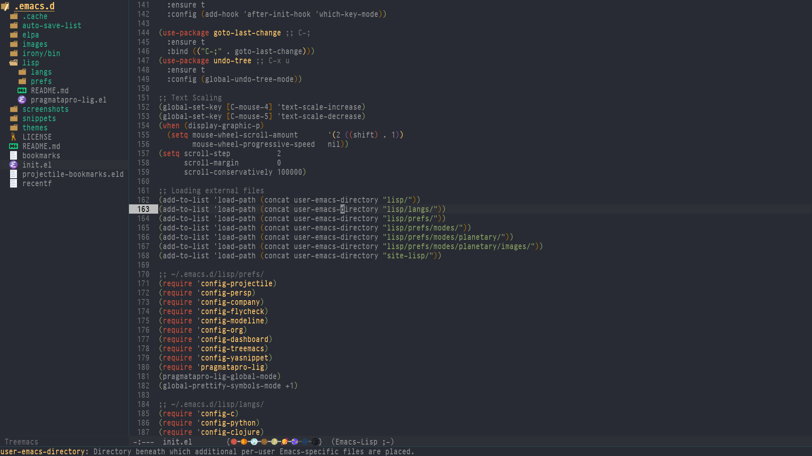

# .emacs.d

## Features

- Plug & Play
- Support for multiple programming languages (w/ auto-completion "company" support.)
   - C/C++/C#
   - Clojure
   - Python
- [Flycheck](https://www.flycheck.org/) for Syntax.
- Flyspell for Spelling
- [Writeroom](https://github.com/joostkremers/writeroom-mode)/[good](https://github.com/bnbeckwith/writegood-mode) support.
- [Org Chef](https://github.com/Chobbes/org-chef/) support
- [which-key](https://github.com/justbur/emacs-which-key)
- [Treemacs](https://github.com/Alexander-Miller/treemacs)

## Usage

See [Installation](#installation) for Installation details.

[PragmataPro](https://fsd.it/shop/fonts/pragmatapro/) is a paid font by Fabirizio Schiavi that I personally cannot recommend enough, well worth the price.

In [Screenshots](#screenshots) you can see examples of its appearance in Emacs.

## Installation

**Flyspell**

Another common error that you might come across when trying to take advantage of Flyspell is an error in "en_US".

To fix this, install `aspell-en` on your desktop.

Among the `lang/` configuration files you can find that there are small notes here and there pertaining to my setup in these.

Last but not least: If you have installed [irony](https://github.com/Sarcasm/irony-mode/)'s server in the past, remove `/tmp/build-irony-server-x.x.x` (or `Users/{user}/Temp/` for Windows)

## Roadmap

I'm going to primarily continue to focus development on:

- Web programming-related functionality
- General programming language support (Java, Elixir, etc.)
- Org related functionality
- Design (Icons, Theming, etc.)

## Screenshots

Atom One Dark Examples:

Custom Solarized Theme (contains issues with Company-Mode):

